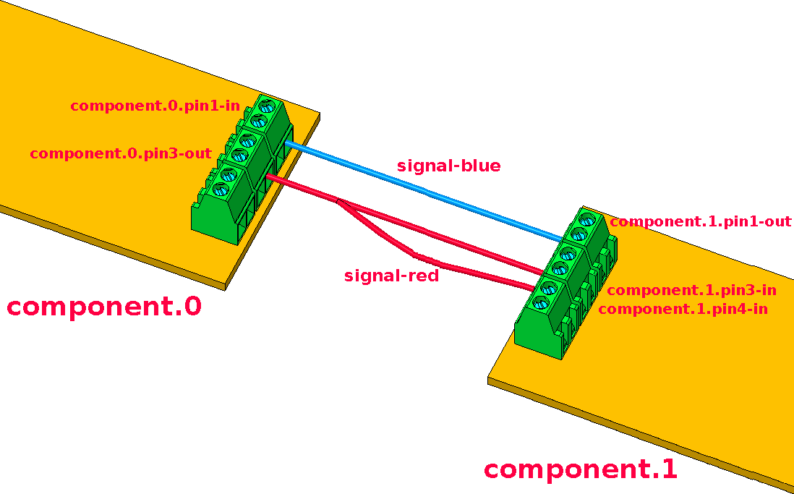
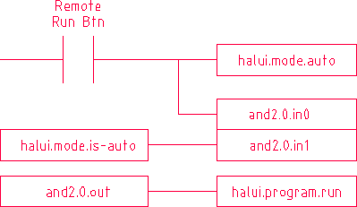

# HAL

Hal stands for ```hardware abstraction layer```

Assembles blocks to work together

At first it was only for hardware devices

## Principles

* Any system consists of interconnected components.
* The machine builder must select, mount and wire these pieces together to make a complete system.



translates to :

```txt
net signal-blue    component.0.pin1-in      component.1.pin1-out
net signal-red     component.0.pin3-out     component.1.pin3-in     component.1.pin4-in
```

### Part selection

* The machine builder treats each individual part as black boxes.
* In the HAL world, the integrator must decide what HAL components are needed. 
* Usually every interface card will require a driver. 
* Additional components may be needed for software generation of step pulses, PLC functionality, and a wide variety of other tasks.

### Interconnecting

* When using HAL, components are interconnected by signals. 
* The designer must decide which signals are needed, and what they should connect.





# Estop

```hal
# --- Load the necessary components ---
# Load the driver for your I/O card (7i96 in this example)
loadrt hm2_eth board_ip="192.168.1.121" config="num_encoders=0 num_stepgens=5"
loadrt threads name1=servo-thread period1=1000000 # 1ms thread

# Load a simple logic component (NOT gate)
loadrt not count=1

# --- Wire the physical input to the HAL ---
# Connect the physical pin "INPUT18" to a HAL pin named "estop_physical"
net estop-physical-in hm2_7i96.0.7i96.gpio.055.in-18 => not.0.in

# --- Apply the necessary logic ---
# The physical input is ACTIVE LOW (FALSE when pressed).
# We need to INVERT it to get an ESTOP signal that is TRUE when active.
net estop-active not.0.out => iocontrol.0.emc-enable-in

# --- Add the components to a thread so they run ---
addf not.0 servo-thread
addf hm2_7i96.0.read servo-thread
addf hm2_7i96.0.write servo-thread
```

How it works:

* The physical E-Stop button is wired to INPUT18.

* The hm2_7i96 driver reads this pin and sets the value of its HAL pin hm2_7i96.0.7i96.gpio.055.in-18.

* The net command connects this physical pin to the input of a not component.

* The not component inverts the signal:

    * E-Stop NOT pressed (circuit closed): in-18 is TRUE -> not.out is FALSE

    * E-Stop IS pressed (circuit open): in-18 is FALSE -> not.out is TRUE

* This inverted signal (estop-active) is then connected to iocontrol.0.emc-enable-in. This pin expects TRUE to enable the machine and FALSE to disable it. Our logic now correctly disables the machine when the E-Stop is pressed.